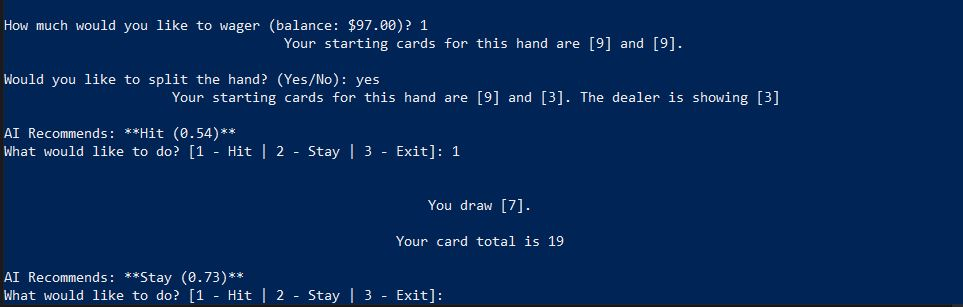
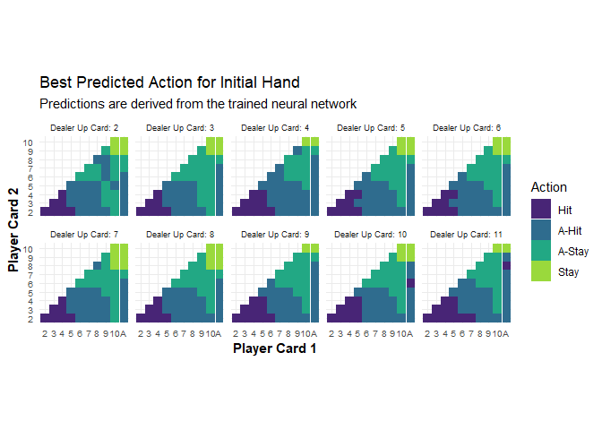

Blackjack Project
================

See the README file in each directory for more details.

## simple_blackjack
Repository containing a Python module that supports a terminal-based game of Blackjack.

## ai
Repository containing code for training a machine learning model to play Blackjack using reinforcement learning.

