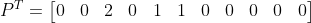
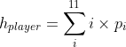
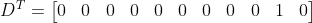
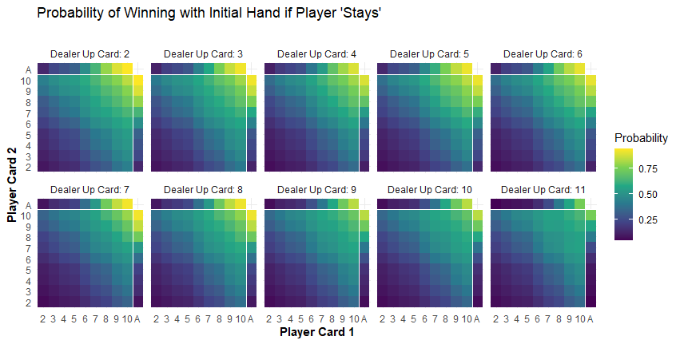
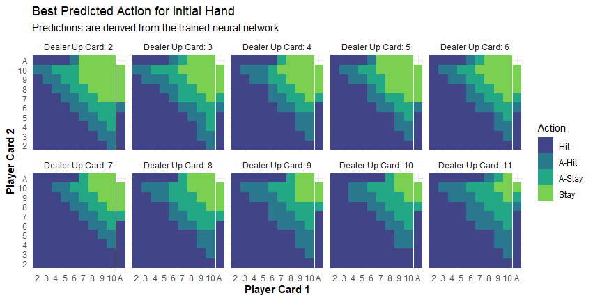

Creating a Blackjack AI with Reinforcement Learning, Python, and Keras
================

## Introduction

In this repo, I provide some Python code for training a machine learning
model to play the game of blackjack. The model was fit using the Keras
API for Tensorflow 2.2.

Before, I delve into model fitting, I will provide some background into
the game, the decisions that went into constructing the machine model,
and how the model was implemented to create an AI.

The following imports are required in order for the code in this repo to
function properly:

``` python
import keras
import matplotlib.pyplot as plt
import numpy as np
import tensorflow as tf
from keras import initializers
from keras import regularizers
from keras.layers import Dense
from keras.optimizers import Adam
```

### Background

Blackjack is a good game on which to train a machine learning model
because the rules are straightforward and the gameplay is mostly
algorithmic. The steps for playing a hand of blackjack are as follows:

1.  A player starts with two cards in their “hand”, whose overall value
    is determined by summing the values of the cards together (face
    cards are worth 10). The goal for the player is to maximize the
    value of their hand without exceeding a total value of 21.

2.  The dealers initial hand also consists of two cards, but only one of
    these is visible to the player(s).

3.  At each time step in the game, the player can either request an
    additional card from the dealer (“hit”) or opt to stay with their
    current hand (“stay”).

4.  If the player’s hand value exceeds 21 (“bust”), the player loses the
    round. If the player’s hand value is less than 21 and they choose
    stay, the dealer begins their routine.

5.  After a player elects to stay, the dealer is obligated to increase
    the value of their hand by hitting until the value of the hand is
    greater than 16. At this point, if the value of the dealer’s hand is
    greater than 21, the player wins. If the value of the dealer’s hand
    is greater than the player’s hand (and less than or equal to 21),
    the dealer wins. Otherwise, the player also wins the round.

6.  If the player or dealer busts and their hand contains one or more
    ace cards, the value of an ace is converted from 11 to 1. The player
    or dealer can then resume their hand. (Another reason why it is
    important to consider the composition of a hand and not only its
    standing value at each decision-making opportunity).

Not considered here is the ability to split a hand under certain
circumstances. While an important rule and facet of the game, it is not
relevant to the decisions made on the basis of predictions from the
machine learning model.

<center>


</center>

In blackjack, players can maximize their performance by following a
general set of rules on when to hit or stay, a decision that is
influenced by both the current value of the player’s hand as well as the
value of the card shown by the dealer (this is **not** the same as
“counting cards”). **The goal of this project is to build a machine
learning model to generate a similar set of rules such as these. Once
trained, this model will be used to determine the decisions made by a
game-playing AI on the basis of the predicted outcome of a given hand.**

### Representing the data

When I first had the thought to train a model to play blackjack, I
purposefully refrained from doing online research to see what approaches
others had used to achieve similar goals because I wanted the exercise
of tackling the problem from scratch. The first step of the process was
how deciding how to represent the data, in this case a hand of cards,
for use in a machine learning model.

My initial thought was to predict the outcome of a hand at each time
step based only on the current value of the hand, ignoring the card
composition of the hand that yields its overall value. However, after
some consideration I decided that composition of the cards would also be
important information when predicting the potential outcomes for a given
hand, and that I would need to somehow encode this information as a
feature of the data. Indeed, a well-known fact about the game of
blackjack is that is typically advantageous to start a hand with smaller
value cards.

To capture this information, I chose to represent the hand of cards as a
11-D column vector **P**, one dimension for each card in the deck (plus
the “1” card obtained from conversion of an ace). Here, the value of
*p\_i* corresponds to the **number of cards in the hand** with a value
of *i*. Therefore, the composition of each hand is encoded in the
structure of the vector.

<center>


</center>

For example, consider the following hand represented in the vector form
just described:

<center>



</center>

Can you determine the card composition of the hand? You should get
\[3\], \[3\], \[5\], and \[6\] for a total value of 17. In fact, this
method of representing the composition of a hand of cards also makes it
easy to calculate its overall value when simulating each game because
the value of a player’s hand *h* is given from:

<center>



</center>

The following function is used to simulate dealing cards (from an
infinitely large number of standard playing decks) by randomly
generating the “card vectors” described above:

``` python
# Create some helper functions for the main program loop
def create_card_vectors(n: int, deck: tuple):
    """
    This function creates 'card vectors' - column vectors with 10 rows, where i-th row corresponds to playing cards
    with value i. The scalar value of each row represents the number of each card the player currently posses.
    :param n: integer specifying the number of 'card vectors' to return
    :param deck: tuple representing the card deck to be sampled from. Each element in the deck should be a card value.
    :return: a numpy array of shape (1,11) and sum of n. The positions of the values is sampled the card values
     in the deck.
    """
    n_cards = len(set(deck))
    vec = np.array([[0] * n_cards])
    val = np.random.choice(deck[1:], n, replace=True) #  Do not sample '1'
    for i in val:
        vec[:, i-1] += 1
    return vec
```

For example, the starting hand of a player is generated here using the
function that was just
defined.

``` python
>>> hand = create_card_vectors(n=2, deck=(1,2,3,4,5,6,7,8,9,10,10,10,10,11))
>>> print(hand)
array([[0, 0, 1, 0, 0, 0, 0, 0, 0, 1, 0]])
```

The above array represents a starting hand with cards \[3\] and \[10\]
for a total hand value of 13. Note also that the `tuple` representing a
deck of cards contains four copies of the value of 10 but only a single
copy for all other values. This is to take into account that cards with
a value of 10 are represented by the \[10\] card as well as the face
cards \[J\], \[Q\], and \[K\].

Before a player makes their decision to stay with their current cards
(or loses by busting), only a single card from the dealer’s hand **D**
is known to the player(s). This information is also important to include
in the model (see also the strategy chart in the first figure above).
For example, consider the following card vector belonging to the dealer
and known to the player(s) during the course of the round. It reveals
the dealer is in possesseion of a \[10\] card:



Once the player decides to stay with their current set of cards, the
player and dealer card vectors are passed to a function `dealer()` that
will simulate the outcome of the round. The function will return `True`
if the player wins and `False` if not.

``` python
def dealer(player_hand, dealer_hand, deck: tuple):
    """
    This function simulates the behavior of a dealer in the game of "21". For a given input 'val', representing the
    value of a player's hand, the dealer draws randomly from a set of cards while attempting to increase the value of
    their hand to either match or exceed the player's hand without going over 21.
    :param player_hand: numpy array representing the player's current hand.
    :param dealer_hand: numpy array representing the dealer's current (revealed) hand.
    :param deck: tuple representing the card deck to be sampled from. Each element in the deck should be a card value.
    :return: a boolean value indicating whether a player won (True) or lost (False) the hand.
    """
    vals = np.unique(deck)
    assert (player_hand * vals).sum() <= 21
    while (dealer_hand * vals).sum() < 17:
        new_card = create_card_vectors(1, deck)
        dealer_hand = dealer_hand + new_card
        if (dealer_hand * vals).sum() > 21 and dealer_hand[0][10] > 0: #Soft hand
            dealer_hand[0][10] -= 1
            dealer_hand[0][0] += 1
        continue
    if (dealer_hand * vals).sum() > 21:
        flag = 0
        return True, flag
    elif  (dealer_hand * vals).sum() < (player_hand * vals).sum():
        flag = 1
        return True, flag
    else:
        flag = 0
        return False, flag
```

Thus, the final data array (`cards`) passed to the machine learning
model will be a 22-D column vector created by concatenating the vectors
**P** and **D**:

``` python
>>> deck = (1,2,3,4,5,6,7,8,9,10,10,10,10,11)
>>> P = create_card_vectors(2, deck) # Player cards
>>> print(P)
array([[0, 0, 2, 0, 1, 1, 0, 0, 0, 0, 0]])
>>> 
>>> D = create_card_vectors(1, deck) # Dealer card revealed
>>> print(D)
array([[0, 0, 0, 0, 0, 0, 0, 0, 0, 1, 0]])
>>> 
>>> cards = np.concatenate((P,D), axis=1)
>>> print(cards)
array([[0, 0, 2, 0, 1, 1, 0, 0, 0, 0, 0, 0, 0, 0, 0, 0, 0, 0, 0, 0, 1, 0]])
```

### Building the model

With the data structure figured out, I then needed to determine at what
point in a game of blackjack that the model should be trained. The model
will primarily help decide whether the AI should ‘hit’ or ‘stay’, but
the payoff of each action is not determined until later in the round,
once the player has finalized their hand and the dealer runs through
their routine. Breaking this down, I came up with the idea to classify
three types of ouctomes directly influenced by the decisions of the
player.

  - Type 1 Outcome (Blue; right): The dealer tried to increase the value
    of their hand, but ended up exceeding a total value of 21 (“dealer
    bust”). If predicted, the AI should elect to ‘stay’ rather than
    ‘hit’ in order to avoid a bust.

  - Type 2 Outcome (Green; center left): The player decided to stay with
    their current hand, but the value was too low and the dealer won
    (“too low”). If predicted, the best decision for the AI is to
    ‘hit’.

  - Type 3 Outcome (Orange; center right): The player decided to stay
    with their current hand and won because the dealer’s hand was
    greater than 16 but still lower than the value of the player’s hand
    (a win; “stay and win”). The optimal decision was to ‘stay’.

  - Type 4 Outcome (Purple; right): The player tried to increase the
    value of their current hand, but ended up exceeding a total value of
    21 (a bust; “too high”). If predicted, the AI should elect to
    ‘stay’.

Once trained, the AI uses the machine learning model to predict the
probability of each type of outcome (*Q-values*), and next uses that
information to decide whether to ‘hit’ or ‘stay’ using a programmed
decison-making process. For example, if the model predicts that the
*total probability* of outcome Types 1, 3, **or** 4 ocurring is greater
than Type 2, then the best to decision is to ‘stay’ with the current
hand. If instead the predicted probability of a Type 2 outcome (“too
low”) is greater than or equal to the total probability of all other
outcomes, the AI will instead elect to receive an additional card
(‘hit’).

``` python
Q_values = model.predict(cards)[0]
if Q_values[0] + Q_values[2] + Q_values[3] > Q_values[1]:
    action = "stay"
else:
    action = "hit"
```

The outcome of each round *y* can be considered a categorical variable
and encoded as follows:

<center>


</center>

Now, we know when to train the model and what the data structures for
the model will look like.

### Model Fitting

<center>


</center>

Simulating games and training models based on the current conditions and
observed outcomes is a form of reinforcement learning (RL). RL generally
requires more examples to train on than other machine learning
approaches, but the data can typically be generated easily by
simluation. The process may just take a while.

The model used is a deep neural network with a user-selected number of
neurons and 2 hidden layers. The output of the model uses a softmax
activation function over a dense layer with 4 neurons, one for each type
of outcome in the game (at least as conceived of here). The `Adam`
optimization algorithm with the learning rate hyperparameter set to
0.001 is used here for backpropagation. Weight decay regularization
(L2=0.01) is also applied to the outputs of each `Dense`
layer.

``` python
def create_online_model(n_neurons: int = 32, verbose: bool=True, save_graph: bool=False) -> tf.keras.Model:
    """
    This function creates a neural network used for online training.
    :param n_neurons: integer. The number of neurons in the first layer of the model.
    :return: A compiled tensorflow.keras.Model object.
    """
    inputs = Input(shape=(22,))
    dense_1 = Dense(n_neurons,
                  activity_regularizer=regularlizers.l2(0.01),
                  activation='elu',
                  kernel_initializer="he_uniform",
                  bias_initializer=initializers.RandomNormal()
                  )(inputs)
    dense_2 = Dense(n_neurons, activation='elu',
                  activity_regularizer=regularlizers.l2(0.01),
                  kernel_initializer="he_uniform",
                  bias_initializer=initializers.RandomNormal()
                  )(dense_1)
    outputs = Dense(4, activation='softmax',
                  kernel_initializer="glorot_uniform",
                  )(dense_2)
    model = Model(inputs=inputs, outputs=outputs, name="blackjack_model")
    model.compile(optimizer=Adam(lr=0.001), loss="categorical_crossentropy", metrics=["accuracy"])
    if verbose:
        model.summary()
    if save_graph:
        plot_model(model, "model_graph.png")
    return model
```

The code for simulating a single game of blackjack is given
here:

``` python
def run_simulation(online_model: tf.keras.Model, target_model: tf.keras.Model, deck: tuple):
    """
    This function runs a single instance of a game of 21.
    :param model: the "online" model that is trained on the outcome of each game.
    :param target_model: the target model is used to predict outcomes of a given hand, and its weights are updated
    :param deck: a tuple containing values representing the set of possible cards to draw from.
    :return: an integer value corresponding to the outcome of the simulation. Type A (0), B(1), or C(2).
    """
    vals = np.unique(deck)  # Card values
    y = np.array([[0] * 4])  # Container array for categorical outcome
    # Starting hands of cards for the player and dealer
    player_hand = create_card_vectors(2, deck)
    dealer_hand = create_card_vectors(1, deck)  # Dealer shows only one card at the start
    if player_hand[0][10] == 2:
        player_hand[0][10] -= 1
        player_hand[0][0] += 1
    if (player_hand * vals).sum() == 21:  # Instant win
        return 0

    while True:
        # Array with the player hand and dealer hand represented as 1-D column vectors
        cards = np.concatenate((player_hand, dealer_hand), axis=1)
        # Use the target model to generate predictions based on the hand
        q_values = target_model.predict(cards)[0]
        if q_values[0:3].sum() > q_values[3]:
            action = "stay"
        else:
            action = "hit"

        # Stay
        if action == "stay":
            outcome, flag = dealer(player_hand, dealer_hand, deck)  # Dealer routine returns outcome
            if outcome and flag:
                y[:, 0] += 1
                online_model.fit(cards, y, verbose=False)
                return 0
            elif outcome and not flag:
                y[:, 1] += 1
                online_model.fit(cards, y, verbose=False)
                return 1
            else:
                y[:, 3] += 1
                online_model.fit(cards, y, verbose=False)
                return 3

        # Hit
        if action == "hit":
            new_card = create_card_vectors(1, deck)  # Generate new card vector
            new_hand = player_hand + new_card  # Add new card to existing player hand
            while (new_hand * vals).sum() > 21:
                if new_hand[0][10] == 0:
                    y[:, 2] += 1
                    online_model.fit(cards, y, verbose=False)
                    return 2
                else:
                    new_hand[0][10] -= 1
                    new_hand[0][0] += 1
                    continue
            if (new_hand * vals).sum() <= 21:
                player_hand = new_hand  # Update 'player_hand' value (reiterate loop)
                continue
```

Blackjack simulations are run repeatedly, with the observed outcomes of
the games used as labels and the state of the player and dealer hands
serving as the inputs for training the model. For training, I opted to
borrow methods from Deep Q-Learning by using fixed Q-value targets to
predict the likelihood of the different possible outcomes. Using fixed
Q-value targets have been shown to speed up the rate of learning and
improve estimates of the model parameters during training. This
technique involves actually creating two separate machine learning
models: an “online model” and a “target model”. The target model is used
by the AI to predict the outcomes of a game given the current hand
(i.e., the Q-values), but the actual training based on the outcome of
each round takes place using the online model. After a pre-defined
number of iterations (e.g., every 50th game), the weights of the target
model are updated using the weights estimated from the online model. The
purpose of this approach is to avoid instabilities that can arise during
reinforcement learning, which can ultimately lead to poor optimization
gradients such that the backpropagation algorithm is unable to
effectively explore the parameter space.

The framework used here is very similar to approaches like proper Deep
Q-Learning, but differs in two import respects. First, the
decision-making model is updated each round using a labeled
(categorical) outcome with categorical cross-entropy loss function. True
Q-learning instead involves training a network based on the outcome of a
continuous reward function (e.g., Huber loss) based on the . Second,
there is no “replay buffer” or limited cache of prior gameplay
experiences for the model to call upon. The model used here is updated
after each round, with no memory
limitation.

``` python
def run_simulations(n_train: int, n_update: int = 100, n_report: int = 500):
    """
    This function "manages" multiple instances of games of Blackjack, and uses their outcomes to train reinforcement models
    by machine learning. Here, fixed Q-value targets (from 'target_model') are used to predict the outcome of a given
    hand, while the individual outcomes are used to train a separate "online" model. The weights from the "online"
    model (model) are used to update the target model at a user-specified rate (n_update).
    :param n_train: integer. The number of training iterations to run.
    :param n_update: integer. The number of iterations before the target model is updated from the online model.
    :param n_report: integer. The number of iterations before performance metrics are reported in the console window.
    :return: an integer value corresponding to the outcome of the simulation. Type A (0), B (1), or C (2).
    """
    online_model = create_online_model(16, verbose=False, save_graph=False)  #Create online model
    target_model = keras.models.clone_model(online_model)  # Create target model as copy of online model
    deck = (1, 2, 3, 4, 5, 6, 7, 8, 9, 10, 10, 10, 10, 11)  # Define card deck values
    outcomes = np.zeros(n_train)  # Container for training simulation outcomes
    for ite in range(n_train):  # Iterate over training loops
        outcomes[ite] = run_simulation(online_model=online_model, target_model=target_model, deck=deck)  # Save game outcome
        if ite % n_update == 0:
            target_model.set_weights(online_model.get_weights()) # Update the target model with weights from the online model
        if ite % n_report == 0 and ite > 0:
            # Calculate performance metrics and return results in the console
            unique, counts = np.unique(outcomes[:ite], return_counts=True)
            unique_run, counts_run = np.unique(outcomes[(ite - n_report):ite], return_counts=True)
            overall_win = np.round(counts[0:2].sum() / ite, 4)
            running_win = np.round(counts_run[0:2].sum() / n_report, 4)
            print(f"Iteration: {ite}/{n_train}...Overall Accuracy: {overall_win}...Running Accuracy: {running_win}")
    return online_model, target_model, outcomes
```

Now, all that is left to do is set the number of training iterations and
let the program run:

``` python
# Run game simulations (takes a bit of time)
n_train = 100000
online_model, target_model, outcomes = run_simulations(n_train=n_train, n_update=100)


# serialize model to JSON
model_json = online_model.to_json()
fname = "ai/models/online_model.json"
with open(fname, "w") as json_file:
    json_file.write(model_json)
# serialize weights to HDF5
online_model.save_weights("ai/models/online_model.h5")
print("Saved model to disk")
```

If the model needs to be loaded at a later time:

``` python
# load json and create model
json_file = open('ai/models/online_model.json', 'r')
loaded_model_json = json_file.read()
json_file.close()
loaded_model = model_from_json(loaded_model_json)
# load weights into new model
loaded_model.load_weights("ai/models/online_model.h5")
print("Loaded model from disk")
```

## Exploring the Results

The obvious first test to was to examine the winning rate of the AI.
Using the `run_simulation` function created earlier, I simulated 5000
rounds of Blackjack using the target values from the trained ML model:

``` python
result = []  # Save outcome of each round to container
n_iter = 5000  # Number of games to simulate
deck_of_cards = (1, 2, 3, 4, 5, 6, 7, 8, 9, 10, 10, 10, 10, 11)
for ite in range(0, n_iter):
    np.random.seed(2 * ite)  # For reproducability
    o = run_simulation(loaded_model, loaded_model, deck=deck_of_cards)
    result.append(o)
unique, counts = np.unique(result, return_counts=True)
total_wins = counts[0:2].sum()
print(f"The AI won {total_wins} out of {n_iter} rounds ({round(100*total_wins/n_iter,1)}%).")
The AI won 1804 out of 5000 rounds (36.1%).
```

}

A winning rate of approximately 36% seems reasonably good, especially
when considering the strong influence that the laws of probability have
on the outcomes of each round. But, I will continue exploring other
model fitting techniques to try and improve this number.

I also wanted to get a sense of how the results of the neural network
could guide player’s decisions, given their current hand, similar to the
chart featured in the first figure. Therefore, I plotted the predicted
probability that a player will win a round should they elect to ‘stay’,
based on the cards they were initially dealt and the up card shown by
the dealer. The figure makes intuitive sense given what most people know
about the game of Blackjack: the lower the value of your initial cards,
the less likely you are to win the round. Furthermore, the probability
of winning with a low hand value decreases with larger values of the
dealer’s up card. The results also suggest that the penalty for a bad
‘hit’ is lower with a *soft hand* (i.e., a hand with an Ace) because
of tthis card can take a value of 1 if needed. As a result, the model
shows that players are typically better off hitting with a soft hand
rather than a hard hand due to the lower risk of going bust. This, of
course, makes intuitive sense, but it is nonetheless still fascinating
to see that the model learned that aspect of the game.

Viewing the continuous probabilities, however, also reveals a large
region of the card space where the “best” action is predicted to be only
slightly better than the alternative. In these cases, chance will
largely determine whether an action produces the desired outcome.

``` r
library(tidyr)
library(ggplot2)
library(dplyr)

reticulate::source_python("load_model_results.py")
load_model()
M = get_predctions() %>% 
  reshape::melt()
names(M) <- c("pc1","pc2","duc","action")
M <- M %>% 
  mutate(action_cat = cut(action, seq(0,1, ))) %>% 
  mutate(duc = sprintf("Dealer Up Card: %d", M$duc + 1)) %>%
  mutate(duc = factor(duc, paste("Dealer Up Card:",2:11)))

card_labels = c(2,3,4,5,6,7,8,9,10,"A")
pc = ggplot(M[M$action>0,], aes(x=factor(pc1), y=factor(pc2), fill=action)) + 
  ggtitle("Probability of Winning with Initial Hand if Player 'Stays'", "") +
  geom_tile() +
  scale_fill_viridis_c("Probability", values=c(0,1)) +
  facet_wrap(.~duc, nrow=2, ncol=5) +
  scale_x_discrete("Player Card 1", labels=card_labels) +
  scale_y_discrete("Player Card 2", labels=card_labels) +
  geom_vline(xintercept = 9.5, color="white") +
  theme_minimal() +
  theme(axis.title = element_text(face="bold"))
pc
```



Here I have binned the values predicted by the model, showing starting
player hand card combinations where the model suggests the player should
definitively ‘hit’ or ‘stay’. These include those regions of the card
space where *Pr(Stay) \> 0.6 OR Pr(Stay) \< 0.4*. An ‘ambiguous hit
(A-Hit)’ and ‘ambiguous stay (A-Stay)’ are those card combinations
suggesting either a ‘hit’ or ‘stay’ action respectively, but that also
fall within plus or minus 10 percentage points of 50% (equivalence):

``` r
action_class = ifelse(M$action >= 0.6,
                      "Stay",
                      ifelse(
                        M$action < 0.6 & M$action >= 0.5,
                        "A-Stay",
                        ifelse(M$action < 0.5 & M$action >= 0.4, 
                          "A-Hit", "Hit")
                        )
                      )
action_class = factor(action_class, c("Hit","A-Hit","A-Stay","Stay"))
pd = ggplot(M[M$action>0,], aes(x=factor(pc1), y=factor(pc2), fill=action_class[M$action>0])) + 
  ggtitle("Best Predicted Action for Initial Hand", 
          "Predictions are derived from the trained neural network") +
  geom_tile() +
  scale_fill_viridis_d("Action", begin=0.2, end=0.8) +
  facet_wrap(.~duc, nrow=2, ncol=5) +
  scale_x_discrete("Player Card 1", labels=card_labels) +
  scale_y_discrete("Player Card 2", labels=card_labels) +
  geom_vline(xintercept = 9.5, color="white") +
  theme_minimal() +
  theme(axis.title = element_text(face="bold"))
pd
```



## Future Directions

The game-playing AI shown here uses a machine learning model to decide
the best action (‘hit’ or ‘stay’) given the composition of the current
hand and the value of the dealer up card. From this simple set of
decision-making rules, guided by the predictions ML model, the AI wins
games at a rate of around 37%.

The next step is to incorporate the AI into the `simple_blackjack`
module found in the other directory of this repo. The purpose of this
will be to provide a “suggestion” feature to players. This feature will
report the best predicted choice of action (“Hit”, “A-Hit”, etc.) but
leave the final decision to the player. From there, I hope to record how
my performance (and hopefully, others) at Blackjack changes when
assisted by the AI.
