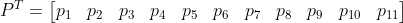

Creating a Blackjack AI with Keras & Reinforcement Learning
================

## Introduction

In this repo, I provide some Python code for training a machine learning
model to play the game of blackjack. The model was fit using the Keras
API for Tensorflow 2.2.

Before, I delve into model fitting, I will provide some background into
the game, the decisions that went into constructing the machine model,
and how the model was implemented to create an AI.

The following imports are required in order for the code in this repo to
function properly:

``` python
import keras
import matplotlib.pyplot as plt
import numpy as np
import tensorflow as tf
from keras import initializers
from keras.layers import Dense
from keras.optimizers import Adam
```

### Background

Blackjack is a good game on which to train a machine learning model
because the rules are straightforward and the gameplay is mostly
algorithmic. The steps for playing a hand of blackjack are as follows:

1.  A player starts with two cards in their “hand”, whose overall value
    is determined by summing the values of the cards together (face
    cards are worth 10). The goal for the player is to maximize the
    value of their hand without exceeding a total value of 21.

2.  The dealers initial hand also consists of two cards, but only one of
    these is visible to the player(s).

3.  At each time step in the game, the player can either request an
    additional card from the dealer (“hit”) or opt to stay with their
    current hand (“stay”).

4.  If the player’s hand value exceeds 21 (“bust”), the player loses the
    round. If the player’s hand value is less than 21 and they choose
    stay, the dealer begins their routine.

5.  After a player elects to stay, the dealer is obligated to increase
    the value of their hand by hitting until the value of the hand is
    greater than 16. At this point, if the value of the dealer’s hand is
    greater than 21, the player wins. If the value of the dealer’s hand
    is greater than the player’s hand (and less than or equal to 21),
    the dealer wins. Otherwise, the player also wins the round.

6.  If the player or dealer busts and their hand contains one or more
    ace cards, the value of an ace is converted from 11 to 1. The player
    or dealer can then resume their hand. (Another reason why it is
    important to consider the composition of a hand and not only its
    standing value at each decision-making opportunity).

Not considered here is the ability to split a hand under certain
circumstances. While an important rule and facet of the game, it is not
relevant to the decisions made on the basis of predictions from the
machine learning model.

<center>


</center>

In blackjack, players can maximize their performance by following a
general set of rules on when to hit or stay, a decision that is
influenced by both the current value of the player’s hand as well as the
value of the card shown by the dealer (this is **not** the same as
“counting cards”). **The goal of this project is to build a machine
learning model to generate a similar set of rules such as these. Once
trained, this model will be used to determine the decisions made by a
game-playing AI on the basis of the predicted outcome of a given hand.**

### Representing the data

When I first had the thought to train a model to play blackjack, I
purposefully refrained from doing online research to see what approaches
others had used to achieve similar goals because I wanted the exercise
of tackling the problem from scratch. The first step of the process was
how deciding how to represent the data, in this case a hand of cards,
for use in a machine learning model.

My initial thought was to predict the outcome of a hand at each time
step based only on the current value of the hand, ignoring the card
composition of the hand that yields its overall value. However, after
some consideration I decided that composition of the cards would also be
important information when predicting the potential outcomes for a given
hand, and that I would need to somehow encode this information as a
feature of the data. Indeed, a well-known fact about the game of
blackjack is that is typically advantageous to start a hand with smaller
value cards.

To capture this information, I chose to represent the hand of cards as a
11-D column vector **P**, one dimension for each card in the deck (plus
the “1” card obtained from conversion of an ace). Here, the value of
*p\_i* corresponds to the **number of cards in the hand** with a value
of *i*. Therefore, the composition of each hand is encoded in the
structure of the vector.

<center>



</center>

For example, consider the following hand represented in the vector form
just described;

<center>


</center>

Can you determine the card composition of the hand? You should get
\[3\], \[3\], \[5\], and \[6\] for a total value of 17. In fact, this
method of representing the composition of a hand of cards also makes it
easy to calculate its overall value when simulating each game because
the value of a player’s hand *h* is given from:

<center>


</center>

The following function is used here to simulate dealing cards by
randomly generating these card vectors:

``` python
# Create some helper functions for the main program loop
def create_card_vectors(n: int, deck: tuple):
    """
    This function creates 'card vectors' - column vectors with 10 rows, where i-th row corresponds to playing cards
    with value i. The scalar value of each row represents the number of each card the player currently posses.
    :param n: integer specifying the number of 'card vectors' to return
    :param deck: tuple representing the card deck to be sampled from. Each element in the deck should be a card value.
    :return: a numpy array of shape (1,11) and sum of n. The positions of the values is sampled the card values
     in the deck.
    """
    n_cards = len(set(deck))
    vec = np.array([[0] * n_cards])
    val = np.random.choice(deck[1:], n, replace=True) #  Do not sample '1'
    for i in val:
        vec[:, i-1] += 1
    return vec
```

For example, here we simulate the starting hand of a player using the
function we just
defined.

``` python
>>> hand = create_card_vectors(n=2, deck=(1,2,3,4,5,6,7,8,9,10,10,10,10,11))
>>> print(hand)
array([[0, 0, 1, 0, 0, 0, 0, 0, 0, 1, 0]])
```

The above array represents a starting hand with cards \[3\] and \[10\]
for a total hand value of 13. Note also that the tuple representing a
deck of cards contains four copies of the value of 10 but only a single
copy for all other values. This is to take into account that cards with
a value of 10 are represented by the \[10\] card as well as the face
cards \[Jack\], \[Queen\], and \[King\].

Before a player makes their decision to stay with their current cards
(or busts), only a single card from the dealer’s hand **D** is known to
the player(s). This information is also important to include in the
model, and, as with the player, will be represented as a vector.

Once the player decides to stay with their current set of cards, the
player and dealer card vectors are passed to a function to simulate the
outcome of game from the dealer sub-routine:

``` python
def dealer(player_hand, dealer_hand, deck: tuple):
    """
    This function simulates the behavior of a dealer in the game of "21". For a given input 'val', representing the
    value of a player's hand, the dealer draws randomly from a set of cards while attempting to increase the value of
    their hand to either match or exceed the player's hand without going over 21.
    :param player_hand: numpy array representing the player's current hand.
    :param dealer_hand: numpy array representing the dealer's current (revealed) hand.
    :param deck: tuple representing the card deck to be sampled from. Each element in the deck should be a card value.
    :return: a boolean value indicating whether a player won (True) or lost (False) the hand.
    """
    vals = np.unique(deck)
    assert (player_hand * vals).sum() <= 21
    while (dealer_hand * vals).sum() < 17:
        new_card = create_card_vectors(1, deck)
        dealer_hand = dealer_hand + new_card
        if (dealer_hand * vals).sum() > 21 and dealer_hand[0][10] > 0:
            dealer_hand[0][10] -= 1
            dealer_hand[0][0] += 1
        continue
    if (dealer_hand * vals).sum() > 21 or (dealer_hand * vals).sum() < (player_hand * vals).sum():
        return True
    else:
        return False
```

Thus, the final data array (`cards`) passed to the machine learning
model will be a 22-D column vector created by concatenating the vectors
**P** and **D**:

``` python
>>> deck = (1,2,3,4,5,6,7,8,9,10,10,10,10,11)
>>> P = create_card_vectors(2, deck)
>>> print(P)
array([[0, 0, 0, 0, 1, 0, 0, 0, 0, 0, 1]])
>>> 
>>> D = create_card_vectors(1, deck)
>>> print(D)
array([[0, 0, 0, 0, 0, 0, 0, 0, 0, 1, 0]])
>>> 
>>> cards = np.concatenate((P,D), axis=1)
>>> print(cards)
array([[0, 0, 0, 0, 1, 0, 0, 0, 0, 0, 1, 0, 0, 0, 0, 0, 0, 0, 0, 0, 1, 0]])
```

### Building the model

<center>


</center>

With the data structure figured out, I then needed to determine at what
point in a game of blackjack that the model should be trained. The model
will primarily help decide whether the AI should ‘hit’ or ‘stay’, but
the efficacy of each action is not determined until later in the round,
once the player has finalized their hand and the dealer runs through
their routine. Breaking this down, I came up with the idea of
classifying three types of ouctomes based on the decisions of the
player. This classification scheme, and how it fits into the
game-playing AI, are summarized in the figure above.

  - Type 1 Outcome (Green; left): The player decided to stay with their
    current hand, but the value was too low and the dealer won.

  - Type 2 Outcome (Purple; right): The player tried to increase the
    value of their current hand, but ended up exceeding a total value of
    21 (a bust).

  - Type 3 Outcome (Orange; center): The player decided to stay with
    their current hand, and won either because the dealer’s hand went
    over 21 or because the dealer’s hand exceeded a value of 16 and was
    still lower than the value of the player’s hand (a win).

The plan is for the AI to work by predicting the most likely outcome of
a given hand, and decides whether to hit or stay on the basis of this
predicted outcome. The type of outcome for each round *y* can be
considered a categorical variable and encoded as follows:

<center>


</center>

Now, we know when to train the model and what the data will look like.

### Model Fitting

Simulating games and training models based on the current conditions and
observed outcomes is a form of reinforcement learning (RL). RL generally
requires more examples to train on than other machine learning
approaches, but the data can typically be generated easily by
simluation. The process just may take a while.

The model used is a deep neural network with a user-selected (but
constant) number of neurons and 2 hidden layers. The output of the model
uses a softmax activation function over a dense layer with 3 neurons,
one neuron for each type of outcome in the game (at least as conceived
of here). The `Adam` optimization algorithm is used here with the
learning rate hyperparameter set to
0.001.

``` python
def create_online_model(n_neurons: int = 128, verbose: bool=True, save_graph: bool=False):
    """
    This function creates a neural network used for online training.
    :param n_neurons: integer. The number of neurons in the first layer of the model.
    :return: A compiled tensorflow.keras.Model object.
    """
    inputs = Input(shape=(22,))
    dense1 = Dense(n_neurons, activation='elu',
                  kernel_initializer="he_uniform",
                  bias_initializer=initializers.RandomNormal()
                  )(inputs)
    dense2 = Dense(n_neurons, activation='elu',
                  kernel_initializer="he_uniform",
                  bias_initializer=initializers.RandomNormal()
                  )(dense1)
    outputs = Dense(3, activation='softmax',
                  kernel_initializer="glorot_uniform",
                  )(dense2)
    model = Model(inputs=inputs, outputs=outputs, name="blackjack_model")
    model.compile(optimizer=Adam(lr=0.001), loss="categorical_crossentropy", metrics=["accuracy"])
    if verbose:
        model.summary()
    if save_graph:
        plot_model(model, "model_graph.png")
    return model
```

The code for simulating a single game of blackjack is given
here:

``` python
def run_simulation(online_model: tf.keras.Model, target_model: tf.keras.Model, deck: tuple):
    """
    This function runs a single instance of a game of 21.
    :param model: the "online" model that is trained on the outcome of each game.
    :param target_model: the target model is used to predict outcomes of a given hand, and its weights are updated
    :param deck: a tuple containing values representing the set of possible cards to draw from.
    :return: an integer value corresponding to the outcome of the simulation. Type A (0), B(1), or C(2).
    """
    vals = np.unique(deck)  # Card values
    y = np.array([[0] * 3])  # Container array for categorical outcome
    # Starting hands of cards for the player and dealer
    player_hand = create_card_vectors(2, deck)
    dealer_hand = create_card_vectors(1, deck)  # Dealer shows only one card at the start
    if player_hand[0][10] == 2:
        player_hand[0][10] -= 1
        player_hand[0][0] += 1
    if (player_hand * vals).sum() == 21:  # Instant win
        y[:, 0] += 1
        cards = np.concatenate((player_hand, dealer_hand), axis=1)
        online_model.fit(cards, y, verbose=False)  # Update online model
        return 0

    while True:
        # Array with the player hand and dealer hand represented as 1-D column vectors
        cards = np.concatenate((player_hand, dealer_hand), axis=1)
        # Use the target model to generate predictions based on the hand
        predictions = target_model.predict(cards)
        j = np.argmax(predictions)  # Predicted categorical outcome

        # Stay-and-Win
        if j == 0:
            outcome = dealer(player_hand, dealer_hand, deck)  # Dealer routine returns outcome
            if outcome:
                y[:, 0] += 1
                online_model.fit(cards, y, verbose=False)  # Update online model
                return 0
            else:
                y[:, 1] += 1
                online_model.fit(cards, y, verbose=False)  # Update online model
                return 1

        # Hit
        if j == 1:
            new_card = create_card_vectors(1, deck)  # Generate new card vector
            new_hand = player_hand + new_card  # Add new card to existing player hand
            while (new_hand * vals).sum() > 21:
                if new_hand[0][10] == 0:
                    y[:, 2] += 1
                    online_model.fit(cards, y, verbose=False)  # Update online model
                    return 2
                else:
                    new_hand[0][10] -= 1
                    new_hand[0][0] += 1
                    continue
            if (new_hand * vals).sum() <= 21:
                player_hand = new_hand  # Update 'player_hand' value (reiterate loop)
                continue

        # Stay
        if j == 2:
            outcome = dealer(player_hand, dealer_hand, deck)  # Dealer routine returns outcome
            if outcome:
                y[:, 0] += 1
                online_model.fit(cards, y, verbose=False)  # Update online model
                return 0
            else:
                y[:, 1] += 1
                online_model.fit(cards, y, verbose=False)  # Update online model
                return 1
```

Blackjack simulations are run repeatedly so that the outcomes of the
games and the state of the player and dealer hands are used as the data
to train the model. I opted to use a special technique to fit the model
called **Deep Q-Learning along with fixed Q-value targets during
training**, which can improve the speed of learning and stabilize
estimates of the model parameters. This involves actually training two
separate models: an online model and target model. The target model is
used by the AI to predict the outcomes of a game given the current hand,
but the actual training takes place using the online model. After a
pre-defined number of iterations (e.g., every 50th game), the weights of
the target model are updated with the weights from the online model. The
purpose of this approach is to avoid instability that can arise during
reinforcement learning, caused by feedback loops that can disrupt the
network and the optimization
gradient.

``` python
def run_simulations(n_train: int, n_update: int = 100, n_report: int = 500):
    """
    This function "manages" multiple instances of games of Blackjack, and uses their outcomes to train reinforcement models
    by machine learning. Here, fixed Q-value targets (from 'target_model') are used to predict the outcome of a given
    hand, while the individual outcomes are used to train a separate "online" model. The weights from the "online"
    model (model) are used to update the target model at a user-specified rate (n_update).
    :param n_train: integer. The number of training iterations to run.
    :param n_update: integer. The number of iterations before the target model is updated from the online model.
    :param n_report: integer. The number of iterations before performance metrics are reported in the console window.
    :return: an integer value corresponding to the outcome of the simulation. Type A (0), B (1), or C (2).
    """
    online_model = create_online_model(16, verbose=False, save_graph=False)  #Create online model
    target_model = keras.models.clone_model(online_model)  # Create target model as copy of online model
    deck = (1, 2, 3, 4, 5, 6, 7, 8, 9, 10, 10, 10, 10, 11)  # Define card deck values
    outcomes = np.zeros(n_train)  # Container for training simulation outcomes
    for ite in range(n_train):  # Iterate over training loops
        outcomes[ite] = run_simulation(online_model=online_model, target_model=target_model, deck=deck)  # Save game outcome
        if ite % n_update == 0:
            target_model.set_weights(online_model.get_weights()) # Update the target model with weights from the online model
        if ite % n_report == 0 and ite > 0:
            # Calculate performance metrics and return results in the console
            unique, counts = np.unique(outcomes[:ite], return_counts=True)
            unique_run, counts_run = np.unique(outcomes[(ite - n_report):ite], return_counts=True)
            overall_acc = np.round(counts[0] / ite, 4)
            running_acc = np.round(counts_run[0] / n_report, 4)
            print(f"Iteration: {ite}/{n_train}...Overall Accuracy: {overall_acc}...Running Accuracy: {running_acc}")
    return online_model, target_model, outcomes
```

Now, all that is left to do is set the number of training iterations and
let the program run:

``` python
# Run game simulations (takes a bit of time)
n_train = 200000
online_model, target_model, outcomes = run_simulations(n_train=n_train, n_update=50)


# serialize model to JSON
model_json = online_model.to_json()
fname = "online_model.json"
with open(fname, "w") as json_file:
    json_file.write(model_json)
# serialize weights to HDF5
online_model.save_weights("online_model.h5")
print("Saved model to disk")
```

If the model needs to be loaded at a later time:

``` python
# load json and create model
json_file = open('online_model.json', 'r')
loaded_model_json = json_file.read()
json_file.close()
loaded_model = model_from_json(loaded_model_json)
# load weights into new model
loaded_model.load_weights("online_model.h5")
print("Loaded model from disk")
```

During training, the winning percentage of the model started to approach
38%. I am still trying out some techniques to improve this number, but
am actually pretty satisfied with how it turned out. More details to
follow later.
